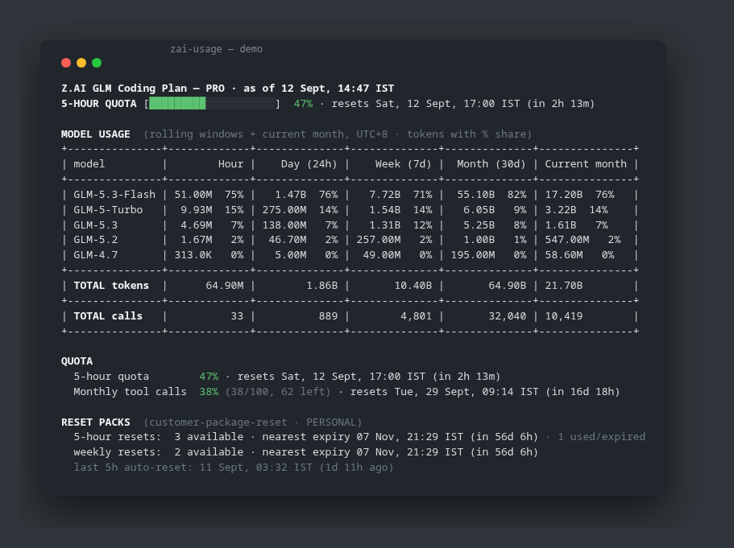

# zai-usage

Terminal CLI for the Z.ai GLM Coding Plan: quota windows, rolling-window model usage, and reset-pack inventory — in one colored ASCII view.



Single-file Bun/TypeScript, zero dependencies. Talks to three undocumented Z.ai monitor endpoints with your GLM Coding Plan API key.

## Install

```bash
curl -fsSL https://raw.githubusercontent.com/LogicIncZo/zai-usage/main/install.sh | bash
```

This drops the script into `~/.local/bin/zai-usage` (with a `#!/usr/bin/env bun` shebang). Requires [bun](https://bun.sh) and `ZAI_API_KEY` (or `Z_AI_API_KEY` / `GLM_API_KEY`) in your environment.

No plan yet? Subscribe to the GLM Coding Plan via [my referral link](https://z.ai/subscribe?ic=5CA0GFZ4CO) — starts at $18/month.

Manual install:

```bash
curl -fsSL -o ~/.local/bin/zai-usage https://raw.githubusercontent.com/LogicIncZo/zai-usage/main/zai-usage.ts
chmod +x ~/.local/bin/zai-usage
```

## Usage

```
zai-usage                     # quota: 5-hour + monthly tool calls, with reset times
zai-usage summary             # everything: model matrix + quota + reset packs
zai-usage usage               # hour-by-hour buckets for today (UTC+8)
zai-usage usage 2026-09-09    # a specific date (Asia/Shanghai calendar day)
zai-usage usage --from "2026-09-01 00:00:00" --to "2026-09-10 23:59:59"
zai-usage --json              # machine-readable (any mode)
zai-usage --demo              # synthetic data, no API key needed (any mode)
zai-usage --color             # force ANSI color even when piped
```

### Example output (synthetic data)

Everything below is generated by `zai-usage summary --demo` — no real account data:

```
Z.AI GLM Coding Plan — PRO · as of 12 Sept, 14:47 IST
5-HOUR QUOTA [#########-----------]  47% · resets Sat, 12 Sept, 17:00 IST (in 2h 13m)

MODEL USAGE  (rolling windows + current month, UTC+8 · tokens with % share)
+---------------+-------------+--------------+--------------+--------------+---------------+
| model         |        Hour |    Day (24h) |    Week (7d) |  Month (30d) | Current month |
+---------------+-------------+--------------+--------------+--------------+---------------+
| GLM-5.3-Flash | 51.00M  75% |   1.47B  76% |   7.72B  71% |  55.10B  82% | 17.20B  76%   |
| GLM-5-Turbo   |  9.93M  15% | 275.00M  14% |   1.54B  14% |   6.05B   9% | 3.22B  14%    |
| GLM-5.3       |  4.69M   7% | 138.00M   7% |   1.31B  12% |   5.25B   8% | 1.61B   7%    |
| GLM-5.2       |  1.67M   2% |  46.70M   2% | 257.00M   2% |   1.00B   1% | 547.00M   2%  |
| GLM-4.7       | 313.0K   0% |   5.00M   0% |  49.00M   0% | 195.00M   0% | 58.60M   0%   |
+---------------+-------------+--------------+--------------+--------------+---------------+
| TOTAL tokens  |      64.90M |        1.86B |       10.40B |       64.90B | 21.70B        |
+---------------+-------------+--------------+--------------+--------------+---------------+
| TOTAL calls   |          33 |          889 |        4,801 |       32,040 | 10,419        |
+---------------+-------------+--------------+--------------+--------------+---------------+

QUOTA
  5-hour quota        47% · resets Sat, 12 Sept, 17:00 IST (in 2h 13m)
  Monthly tool calls  38% (38/100, 62 left) · resets Tue, 29 Sept, 09:14 IST (in 16d 18h)

RESET PACKS  (customer-package-reset · PERSONAL)
  5-hour resets:  3 available · nearest expiry 07 Nov, 21:29 IST (in 56d 6h) · 1 used/expired
  weekly resets:  2 available · nearest expiry 07 Nov, 21:29 IST (in 56d 6h)
  last 5h auto-reset: 11 Sept, 03:32 IST (1d 11h ago)
```

## What it reports

| Section | Contents |
| --- | --- |
| 5-HOUR QUOTA | Token quota percentage with progress bar, reset time, and a peak-window hint (GLM-5.3 burns 3× quota 14:00–18:00 UTC+8 Mon–Fri) |
| MODEL USAGE | Tokens and % share per model across Hour / 24h / 7d / 30d / current-month rolling windows |
| QUOTA | 5-hour + monthly tool-call limits, usage detail per tool (search-prime, web-reader, zread), reset times |
| RESET PACKS | Purchased quota-reset packs: available count, nearest expiry, last auto-reset |

## API endpoints

| Endpoint | Used for |
| --- | --- |
| `GET /api/monitor/usage/quota/limit` | plan level, 5-hour token %, monthly tool-call counters |
| `GET /api/monitor/usage/model-usage?startTime=&endTime=` | per-model tokens/calls in a time span |
| `GET /api/biz/customer-package-reset/list?targetType=PERSONAL` | reset-pack inventory |

Auth: `Authorization: Bearer <api-key>` — the same key Z.ai issues for the GLM Coding Plan.

## Quirks

- Timestamps are **Asia/Shanghai (UTC+8)**, not UTC. The CLI labels its outputs IST.
- `model-usage` rejects spans longer than **31 days** — chunk longer ranges yourself.
- Granularity is auto: spans ≤ 48 h return hourly buckets, longer spans daily.
- `granularity` and bucket labels are server-controlled; the CLI infers bucket width from the span.
- The 5-hour window is a rolling quota, not a fixed window; reset packs add manual resets.

## Get the GLM Coding Plan

🚀 Full support for Claude Code, Cline, and 20+ top coding tools, starting at $18/month. Subscribe via referral link: **[z.ai/subscribe?ic=5CA0GFZ4CO](https://z.ai/subscribe?ic=5CA0GFZ4CO)**

(Yes, that's a referral link — it supports the project.)

## License

MIT
